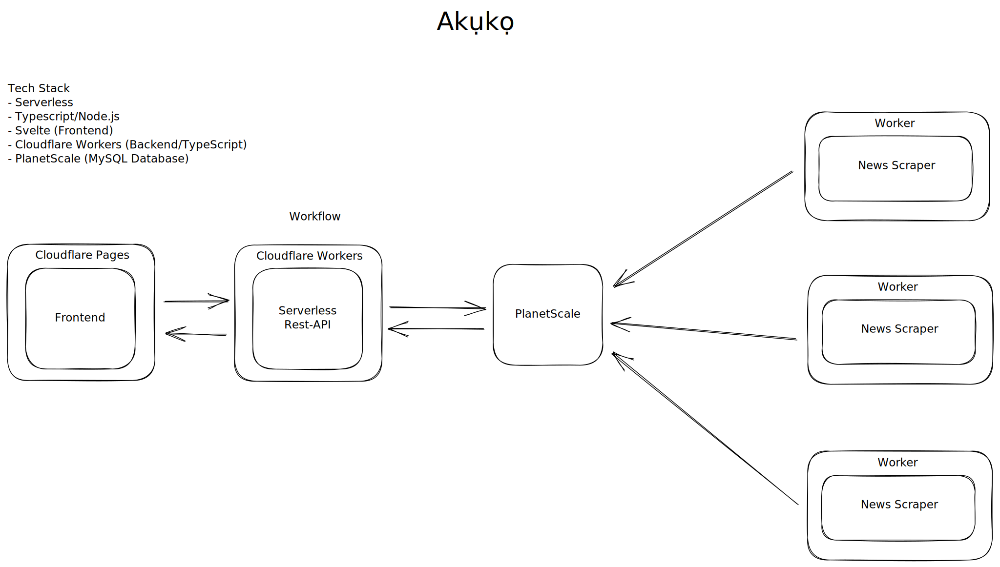

# Akuko - Serverless news aggregator - Beta

Akuko is a web application on serverless infrastructure that fetches news from various sources and displays them in a centralized location.

## Architecture Diagram

## Tech Stack

- Serverless
- Typescript/Node.js
- Svelte (Frontend)
- Cloudflare Workers (Backend/TypeScript)
- PlanetScale (MySQL Database)
